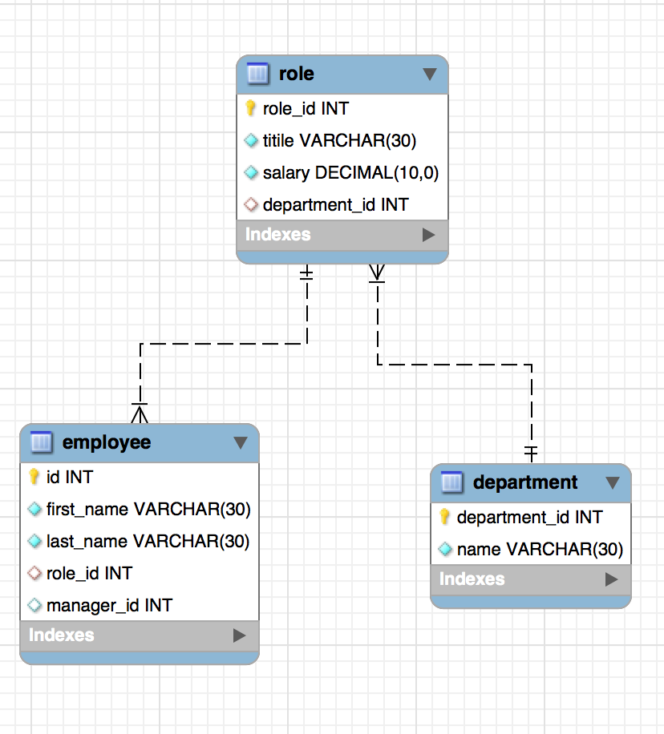

# 12-Employee-Tracker-mysql

This is a simple employee tracker application that ables a user to view and manage the departments, roles, and employees.

The application manages a company's employees using node, inquirer, and MySQL.

## Design and Requirment

* Department Table:

  * id - INT PRIMARY KEY
  * name - VARCHAR(30) to hold department name

* Role Table:

  * id - INT PRIMARY KEY
  * title -  VARCHAR(30) to hold role title
  * salary -  DECIMAL to hold role salary
  * department_id -  INT to hold reference to department role belongs to

* Employee Table:

  * id - INT PRIMARY KEY
  * first_name - VARCHAR(30) holds employee first name
  * last_name - VARCHAR(30) holds employee last name
  * role_id - INT holds reference to role table
  * manager_id - INT holds reference to another employee who is a manager. This field may be null if the employee has no manager
  
Build a command-line application that at a minimum allows the user to:

  * Add departments, 
  * Add roles, 
  * Add employees
  * View departments, 
  * Add roles, 
  * Add employees,
  * Update employee roles

Bonus points if you're able to:

  * Update employee managers,
  * View employees by manager,
  * Delete departments, 
  * Delete roles, and 
  * Delete employees
  * View the total utilized budget of a department -- ie the combined salaries of all employees in that department

## Sample SQL JOINS:

## Demo

### Hints

* You may wish to include a `seed.sql` file to pre-populate your database. This will make development of individual features much easier.

* Review the week's activities for a refresher on MySQL.

* Check out [SQL Bolt](https://sqlbolt.com/) for some extra MySQL help.

**Important**: You will be committing a file that contains your database credentials. 

## Submission

* URL of the GitHub repository: https://tewol.github.io/12-employee-tracker-mysql/

* A video demonstrating the entirety of the app's functionality: 

- - -
© 2021 Hewan Redie.
